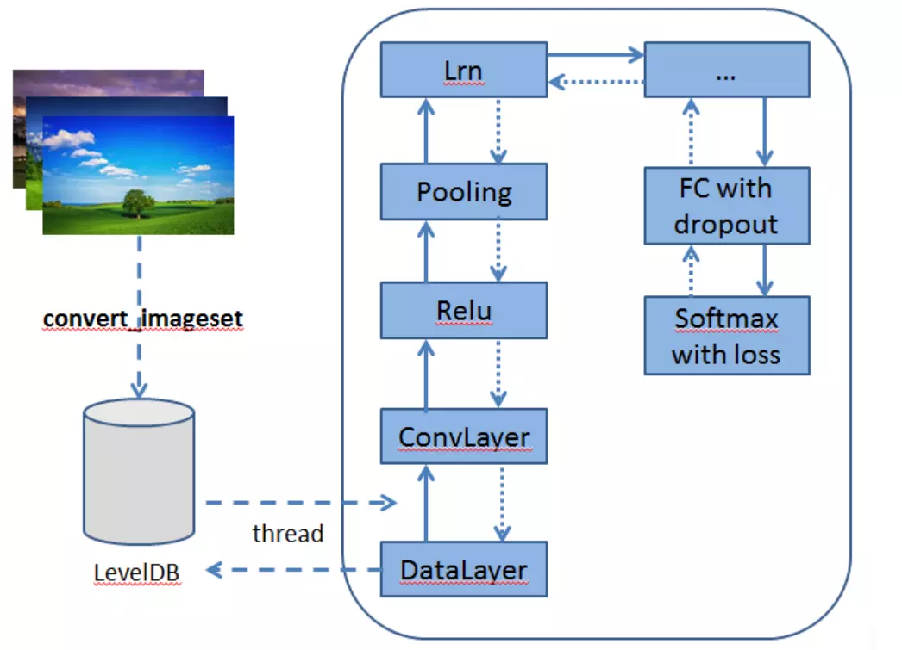

# 深度学习框架笔记

## caffe框架基础

###caffe核心模块

Caffe是纯粹的C++/CUDA架构，支持命令行、Python和MATLAB接口；可以在CPU和GPU直接无缝切换。

Caffe的核心模块有三个，分别是Blobs、Layers和Nets。
Blobs用来进行数据存储、数据交互和处理，通过Blobs，统一制定了数据内存的接口。Layers是神经网络的核心，定义了许多层级结构，它将Blobs视为输入输出。Nets是一系列Layers的集合，并且这些层结构通过连接形成一个网图。下面进行详细介绍：

1. Blobs。Blobs本质是一个N维向量，用来存储数据信息，这些数据信息包括图片、深度网络进行前向传输时的数据和反向求梯度过程时的梯度数据等。对于图像数据来说，Blobs通常是一个4维向量，其格式为(Number，Channel，Height，Width)，其中Channel表示图像的通道数，若图像是单通道的灰度图，则Channel=1；若是3通道的RGB图像，则Channel=3。Height和Width分别表示图像的高度和宽度。至于Number则表示图像批块(Batch)，批处理可以使神经网络有更大的吞吐量。

2. Layers。Layers是神经网络的核心，Caffe设计实现了许多层结构，包括卷积、池化、损失等层结构，利用这些层结构可以实现绝大部分的神经网络模型。Layers将下层的数据输出作为输入，进而通过内部运算输出。Layers层的定义和使用一般需要三个步骤：

   (1)  建立层，包括建立连接关系和初始化其中一些变量参数；

   (2)  前向传输过程，给定输入并计算出相应的输出；

   (3)  反向传播过程，进行反向梯度的计算，并把梯度保存在层结构中。

   如果对于源代码有些层不满意，可以自己定义。总结一下，一般就是要经过这么几步：

   1、参考目录caffe/include/caffe/layers下，定义相关函数。比如链接的仁兄的可以定义为allpass_layer.hpp （   链接：https://blog.csdn.net/king16304/article/details/52763624）

   2、参考caffe/src/caffe/layers目录下相关层实现的函数。这里可以看到，有定义前向传播与反向传播相关函数。 

   3、编辑caffe/src/caffe/proto/caffe.proto，找到LayerParameter，在最后增加一项，里面的编号不要与别的冲突，如果Layer有参数，还需要再定义一个关于自定义层的protobuffer。

   4、然后在src/caffe/layer_factory.cpp中添加响应代码。

   5、src/caffe/test中写一个test_allpass_layer.cpp，用include/caffe/test/test_gradient_check_util.hpp来检查前向后向传播是否正确。

   一共上面的几步，就可以实现自己的一个layer。

3. Nets。Nets是由层Layers组成的，定义了输入、输出、网络各层，并将各层连接成一个有向无环图（DAG），由此定义了一个网络。一个典型的网络应该有数据输入，并且以一个代价函数作为输出，针对不同的任务，例如分类和重构，应选择不同的代价函数。

### Caffe生成的数据格式：Lmdb和Leveldb

它们都是键/值对（Key/Value Pair）嵌入式数据库管理系统编程库。

虽然lmdb的内存消耗是leveldb的1.1倍，但是lmdb的速度比leveldb快10%至15%，更重要的是lmdb允许多种训练模型同时读取同一组数据集。

因此lmdb取代了leveldb成为Caffe默认的数据集生成格式。

